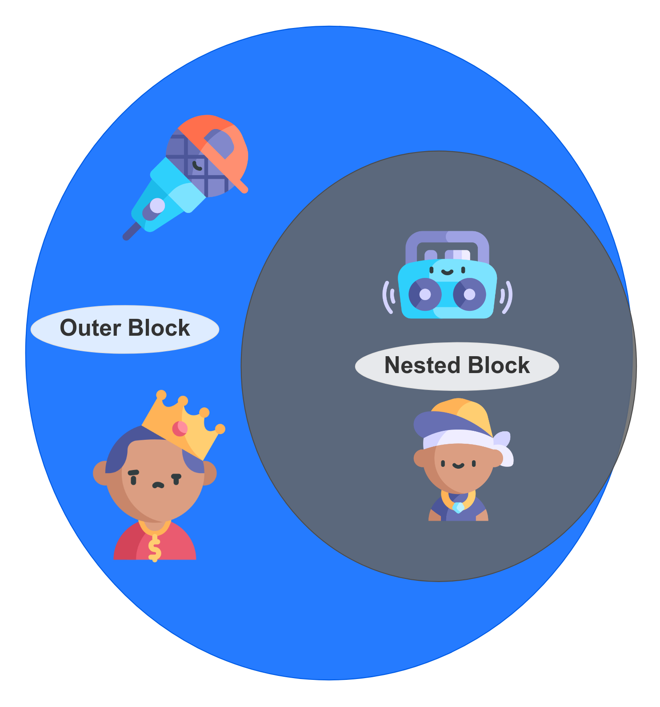
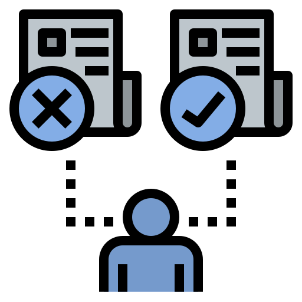

<div class="border">
</img>

<div class="title-slide">
    <h1>Lets Code!</h1>
    <h3>Fundamentals: Control Flow</h3>
    <p>Instructor: Tariq Hook</p>
    <p>You can find me on github @code-rhino</p>
</div>
</div>
-
-

<h2>Key <span class="black">Terms</span></h2>

<div class="livecode livecode-2p">

<div class="col">

* Block Scope
* Conditional Statements
* Loops
* Switch Statements


</div>
<div class="col">

* Determinate Loops
* Nested Loops

</div>
</div>

-
-

 <!-- .element class="info-splash" -->

<!-- .element class="corner-image" -->

<div class="info-splash-content">


## Block Scope

</div>
-

<div class="slide-with-border">

## Block Scope
<div class="livecode livecode-2p">

<div class="col-code-sample">

* Java, like any programming language, supports both conditional statements and loops to determine control flow.
* Before learning about control structures, you need to know more about blocks.
* A block or compound statement consists of a number of Java statements, surrounded by a pair of braces.


</div>
<div class="col-code-sample">

```java
public static void main(String[] args)
{
   int n;
   ...
   {
       int k;
       ...
   } // k is only defined up to here
}


```
>  Blocks define the scope of your variables.<br/><br/> Blocks can be nested.

</div>
</div>

</div>

-

<div class="slide-with-border">

## Block Scope

<div class="livecode livecode-2p">

<div class="col-code-sample">

* The Nested Block is nested inside of Outer Block.
* The Objects in Outer Block can not talk to the objects in Inner Block. 
* The Nested Block Objects are **ENCAPSULATED**.
* Since Nested Block is inside of Outer Block, Nested Objects can access and interact with Outer objects.


</div>
<div class="col-code-sample">

<!-- .element class="display-half-image" -->


</div>
</div>

</div>

-

<div class="slide-with-border">

## Block Scope

<div class="livecode livecode-2p">

<div class="col-code-sample">

* You may not declare identically named variables in two nested blocks


</div>
<div class="col-code-sample">

```java
public static void main(String[] args)
{
   int n;
   ...
   {
       int k;
       int n;
   }
}


```
> Error can't redefine n in inner block

</div>
</div>

</div>

-
-

 <!-- .element class="info-splash" -->

<!-- .element class="corner-image" -->

<div class="info-splash-content">


## Conditional Statements
</div>
 
-


<div class="slide-with-border">

## Conditional Statements

<div class="livecode livecode-2p">

<div class="col-code-sample">

* The conditional statement in Java has the form.


</div>
<div class="col-code-sample">

```java


if(condition) statement
{
   statement1
   statement2
   ...
}


```

</div>
</div>

</div>

-


<div class="slide-with-border">

## If/Else Statement


The conditional statement in Java has the form.


```java


if(condition) statement
{
   statement1
   statement2
   ...
}

if (currentSensor.sensesMovement() == true) {
  currentSensor.reset();
}


```


</div>

-


<div class="slide-with-border">

## If/Else Statement


The conditional statement in Java has the form.


```java


if (condition1) {
  // block of code to be executed if condition1 is true
} else if (condition2) {
  // block of code to be executed if the condition1 is false and 
  // condition2 is true
} else {
  // block of code to be executed if the condition1 is false and 
  // condition2 is false
}

```


</div>

-


<div class="slide-with-border">

## Control Flow

<div class="livecode livecode-2p">

<div class="col-code-sample">

* Control structure code created `branches`, or different paths that the code can take.
* One code path when the condition succeeds and one for when it fails.

<!-- .element class="display-small-image" -->


</div>
<div class="col-code-sample">

```java

if(condition) {
 // do something
} else {
 // do something else
}


```

</div>
</div>

</div>

-
-

 <!-- .element class="info-splash" -->

<!-- .element class="corner-image" -->

<div class="info-splash-content">


## Loops

</div>

-
<div class="slide-with-border">

## Loops

The while loop executes a statement (which may be a block statement) while a condition is true

```
while(condition) statement

while (player1.lives()) {
  player1.calculateCurrentLevels();
}
```
The while loop will never execute if the condition is false at the outset

</div>

-

<div class="slide-with-border">

If you want to make sure a block is executed at least once, you need to move the test to the bottom, using the do/while loop.

```
do statement while (condition);

do sensors1.processNextSensorEvent() while (sensor1.hasEvents());
```

</div>

-

<div class="slide-with-border">

## Determinate Loops

The for loop is a general construct to support iteration controlled by a counter or similar variable that is updated after every iteration.

```
for (int i = 1; i <= 10; i++)
    System.out.println(i);

for (int i = 23; i != 0 10; i--)
    System.out.println(i);
```
</div>

-
<div class="slide-with-border">

## Multiple Selections—The switch Statement

```
switch (choice)
{
    case 1:
        ...
        break;
    case 2:
        ...
        break;
    case 3:
        ...
        break;
    default:
        // bad input ...
        break;
}
```

</div>

-
<div class="slide-with-border">

A case label can be

- A constant expression of type char, byte, short, or int
- An enumerated constant
- Starting with Java SE 7, a string literal

</div>

-
<div class="slide-with-border">

### Statements That Break Control Flow

The same break statement that you use to exit a switch can also be used to break out of a loop

```
while (years <= 100) {
    balance += payment;
    double interest = balance * interestRate / 100;
    balance += interest;
    if (balance >= goal) break;
    years++;
}
```

</div>

-

<div class="slide-with-border">

The continue statement transfers control to the header of the innermost enclosing loop

```
Scanner in = new Scanner(System.in);
while (sum < goal)
{
    System.out.print("Enter a number: ");
    n = in.nextInt();
    if (n < 0) continue;
    sum += n; // not executed if n < 0
}
```
</div>

-
-
<h2>Wrap <span class="black">Up</span></h2>

<div class="livecode livecode-2p">

<div class="col">

* Block Scope
* Conditional Statements
* Loops
* Switch Statements


</div>
<div class="col">

* Determinate Loops
* Nested Loops

</div>
</div>

-
-

 <!-- .element class="info-splash" -->

<!-- .element class="corner-image" -->

<div class="info-splash-content">


## Keep Coding !!!
### Clean Code is Happy Code

</div>