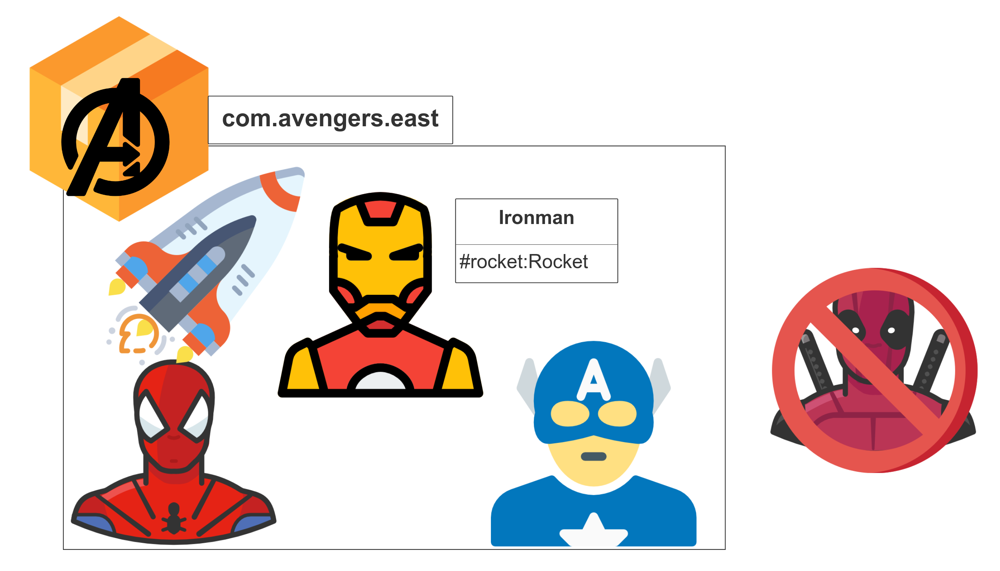

<div class="border">
</img>

<div class="title-slide">
    <h1>Lets Code!</h1>
    <h2>Slide Title22</h2>
    <p>Instructor: Tariq Hook</p>
    <p>You can find me on github @code-rhino</p>
</div>
</div>

-
-

<h2>Key <span class="black">Terms</span></h2>

<div class="livecode livecode-2p">

<div class="col">

* Item 1

</div>
<div class="col">

* Item 1

</div>
</div>

-
-

 <!-- .element class="info-splash" -->

<!-- .element class="corner-image" -->

<div class="info-splash-content">


## Section Title
### Sub Title

</div>
-
<div class="slide-with-border">

## Full Page Code
```javascript fullpage
import React, { useState } from 'react';

function Example() {
    const [count, setCount] = useState(0);

    return (
    &lt;div&gt;
        &lt;p&gt;You clicked {count} times&lt;/p&gt;
        &lt;button onClick={() =&gt; setCount(count + 1)}&gt;
        Click me
        &lt;/button&gt;
    &lt;/div&gt;
    );
}

```
</div>

-

<div class="slide-with-border">

## Snippet  Code

Code Sample 1

```javascript
import React, { useState } from 'react';

function Example1() {
}

```
Code sample 2

```javascript
import React, { useState } from 'react';

function Example2() {
}

```
</div>

-

<div class="slide-with-border">

## Code and Text 

<div class="livecode livecode-2p">

<div class="col-code-sample">

Lorem ipsum dolor sit amet, consectetur adipiscing elit. Donec rutrum, risus vel ultricies dapibus, turpis sapien mollis quam, et pulvinar dolor diam non turpis.

</div>
<div class="col-code-sample">

```javascript
import React, { useState } from 'react';

function Example2() {
}

```

</div>
</div>

</div>

-

<div class="slide-with-border">

## Fragments Example

<p class="fragment fade-up">What is an Interface?</p>
<p class="fragment fade-up">Declaring an Interface</p>
<p class="fragment fade-up">Implementing an Interface</p>
<p class="fragment fade-up">Converting to an Interface Type</p>

</div>

-
<div class="slide-with-border">

## Show image

<!-- .element class="display-large-image" -->
</div>

-


<div class="slide-with-border">

## Image and Text 

<div class="livecode livecode-2p">

<div class="col-code-sample">

Lorem ipsum dolor sit amet, consectetur adipiscing elit. Donec rutrum, risus vel ultricies dapibus, turpis sapien mollis quam, et pulvinar dolor diam non turpis.

</div>
<div class="col-code-sample">

<!-- .element class="display-half-image" -->

</div>
</div>

</div>


-
-

 <!-- .element class="info-splash" -->

<!-- .element class="corner-image" -->

<div class="info-splash-content">


## Section Title 2
### Sub Title

</div>
-
<div class="slide-with-border">

## Bullets

* An interface is a contract that all classes implementing it must follow.
* It means that code can be written against the interface without worrying about what an actual object will do with it.
* Couples a class to a behavior

</div>

-
<div class="slide-with-border">

## Callout Box

> List<String> someList = new ArrayList<>();

`Bold` example of `see`

</div>
-
<div class="slide-with-border">

### Sub 
* Comparator<T>
* Runnable
* EventHandler<T>
* Serializable
* Cloneable

</div>

-
-
 

<h2>Wrap <span class="black">Up</span></h2>

<div class="livecode livecode-2p">

<div class="col">

* Item 1

</div>
<div class="col">

* Item 1

</div>
</div>

-
-
 <!-- .element class="info-splash" -->

<!-- .element class="corner-image" -->

<div class="info-splash-content">


## Keep Coding !!!
### Clean Code is Happy Code

</div>